# Dependency Graph

```mermaid
---
config:
  layout: elk
---
flowchart LR

    %% ============================================================
    %% Entry Point
    %% ============================================================
    subgraph Entry["Entry Point"]
        main["main.c"]
    end

    %% ============================================================
    %% Compiler Core
    %% ============================================================
    subgraph Core["Compiler Core"]
        compiler["compiler.c"]
        arena["arena.c"]
        diagnostic["diagnostic.c"]
        rules["rules.c"]
        util["util.c"]
    end

    %% ============================================================
    %% Lexer
    %% ============================================================
    subgraph Lex["Lexer"]
        lexer["lexer.c"]
    end

    %% ============================================================
    %% Parser
    %% ============================================================
    subgraph Parse["Parser"]
        parser_core["parser_core.c"]
        parser_blocks["parser_blocks.c"]
        parser_cdc["parser_cdc.c"]
        parser_expressions["parser_expressions.c"]
        parser_import["parser_import.c"]
        parser_instance["parser_instance.c"]
        parser_mem["parser_mem.c"]
        parser_module["parser_module.c"]
        parser_mux["parser_mux.c"]
        parser_port["parser_port.c"]
        parser_project["parser_project.c"]
        parser_project_blocks["parser_project_blocks.c"]
        parser_register["parser_register.c"]
        parser_simulation["parser_simulation.c"]
        parser_statements["parser_statements.c"]
        parser_template["parser_template.c"]
        parser_testbench["parser_testbench.c"]
        parser_wire["parser_wire.c"]
    end

    %% ============================================================
    %% AST
    %% ============================================================
    subgraph AST["AST"]
        ast["ast.c"]
        ast_json["ast_json.c"]
    end

    %% ============================================================
    %% Semantic Analysis
    %% ============================================================
    subgraph Sem["Semantic Analysis"]
        driver["driver.c"]
        driver_assign["driver_assign.c"]
        driver_clocks["driver_clocks.c"]
        driver_comb["driver_comb.c"]
        driver_control["driver_control.c"]
        driver_expr["driver_expr.c"]
        driver_flow["driver_flow.c"]
        driver_instance["driver_instance.c"]
        driver_literal["driver_literal.c"]
        driver_mem["driver_mem.c"]
        driver_net["driver_net.c"]
        driver_operators["driver_operators.c"]
        driver_project["driver_project.c"]
        driver_project_hw["driver_project_hw.c"]
        driver_testbench["driver_testbench.c"]
        driver_tristate["driver_tristate.c"]
        driver_width["driver_width.c"]
        sem_type["type.c"]
        sem_literal["literal.c"]
        const_eval["const_eval.c"]
        template_expand["template_expand.c"]
    end

    %% ============================================================
    %% IR
    %% ============================================================
    subgraph IR["Intermediate Representation"]
        ir_build_design["ir_build_design.c"]
        ir_build_clock["ir_build_clock.c"]
        ir_build_signal["ir_build_signal.c"]
        ir_build_expr["ir_build_expr.c"]
        ir_build_stmt["ir_build_stmt.c"]
        ir_build_instance["ir_build_instance.c"]
        ir_build_memory["ir_build_memory.c"]
        ir_library["ir_library.c"]
        ir_div_guard["ir_div_guard.c"]
        ir_tristate_transform["ir_tristate_transform.c"]
        ir_serialize["ir_serialize.c"]
    end

    %% ============================================================
    %% Verilog Backend
    %% ============================================================
    subgraph VerilogBE["Backend: Verilog-2005"]
        v_main["verilog_main.c"]
        v_common["verilog/common.c"]
        v_constraints["constraints.c"]
        v_emit_decl["verilog/emit_decl.c"]
        v_emit_expr["verilog/emit_expr.c"]
        v_emit_stmt["verilog/emit_stmt.c"]
        v_emit_blocks["verilog/emit_blocks.c"]
        v_emit_instances["verilog/emit_instances.c"]
        v_emit_wrapper["verilog/emit_wrapper.c"]
        v_alias["alias.c"]
    end

    %% ============================================================
    %% RTLIL Backend
    %% ============================================================
    subgraph RtlilBE["Backend: RTLIL"]
        r_main["rtlil_main.c"]
        r_common["rtlil/common.c"]
        r_emit_cells["emit_cells.c"]
        r_emit_instances["rtlil/emit_instances.c"]
        r_emit_memory["emit_memory.c"]
        r_emit_module["emit_module.c"]
        r_emit_process["emit_process.c"]
        r_emit_wrapper["rtlil/emit_wrapper.c"]
    end

    %% ============================================================
    %% Simulator
    %% ============================================================
    subgraph Sim["Simulator"]
        sim_engine["sim_engine.c"]
        sim_state["sim_state.c"]
        sim_eval["sim_eval.c"]
        sim_exec["sim_exec.c"]
        sim_value["sim_value.c"]
        sim_perf["sim_perf.c"]
        sim_vcd["sim_vcd.c"]
        sim_fst["sim_fst.c"]
        sim_jzw["sim_jzw.c"]
        sim_waveform["sim_waveform.c"]
    end

    %% ============================================================
    %% LSP
    %% ============================================================
    subgraph LSP["Language Server Protocol"]
        lsp_server["lsp_server.c"]
        lsp_io["lsp_io.c"]
        lsp_json["lsp_json.c"]
        lsp_project_discovery["lsp_project_discovery.c"]
    end

    %% ============================================================
    %% Reports
    %% ============================================================
    subgraph Reports["Reports"]
        chip_report["chip_report.c"]
        memory_report["memory_report.c"]
        alias_report["alias_report.c"]
        tristate_report["tristate_report.c"]
    end

    %% ============================================================
    %% Support Modules
    %% ============================================================
    subgraph Support["Support Modules"]
        chip_data["chip_data.c"]
        path_security["path_security.c"]
        repeat_expand["repeat_expand.c"]
    end

    %% ============================================================
    %% Third-Party
    %% ============================================================
    subgraph ThirdParty["Third-Party"]
        jsmn["jsmn.h"]
        sqlite3["sqlite3"]
    end

    %% ============================================================
    %% DEPENDENCIES: main.c (entry point)
    %% ============================================================
    main --> compiler
    main --> lexer
    main --> ast
    main --> ast_json
    main --> parser_core
    main --> driver
    main --> ir_build_design
    main --> ir_serialize
    main --> v_main
    main --> r_main
    main --> rules
    main --> chip_data
    main --> template_expand
    main --> repeat_expand
    main --> sim_engine
    main --> sim_waveform
    main --> path_security
    main --> lsp_server
    main --> util

    %% ============================================================
    %% DEPENDENCIES: compiler.c
    %% ============================================================
    compiler --> ast
    compiler --> arena
    compiler --> diagnostic
    compiler --> util

    %% ============================================================
    %% DEPENDENCIES: lexer.c
    %% ============================================================
    lexer --> ast
    lexer --> diagnostic
    lexer --> util
    lexer --> rules

    %% ============================================================
    %% DEPENDENCIES: AST
    %% ============================================================
    ast --> util
    ast_json --> ast

    %% ============================================================
    %% DEPENDENCIES: Parser (all parser files share parser_internal.h)
    %% ============================================================
    parser_core --> ast
    parser_core --> lexer
    parser_core --> diagnostic
    parser_core --> util
    parser_core --> rules
    parser_blocks --> parser_core
    parser_cdc --> parser_core
    parser_expressions --> parser_core
    parser_import --> parser_core
    parser_import --> path_security
    parser_instance --> parser_core
    parser_mem --> parser_core
    parser_module --> parser_core
    parser_mux --> parser_core
    parser_port --> parser_core
    parser_project --> parser_core
    parser_project_blocks --> parser_core
    parser_register --> parser_core
    parser_simulation --> parser_core
    parser_statements --> parser_core
    parser_template --> parser_core
    parser_testbench --> parser_core
    parser_wire --> parser_core

    %% ============================================================
    %% DEPENDENCIES: Semantic Analysis
    %% ============================================================
    driver --> ast
    driver --> diagnostic
    driver --> rules
    driver --> util
    driver_assign --> driver
    driver_clocks --> driver
    driver_comb --> driver
    driver_control --> driver
    driver_expr --> driver
    driver_flow --> driver
    driver_instance --> driver
    driver_instance --> chip_data
    driver_literal --> driver
    driver_mem --> driver
    driver_net --> driver
    driver_operators --> driver
    driver_project --> driver
    driver_project_hw --> driver
    driver_project_hw --> chip_data
    driver_testbench --> driver
    driver_tristate --> driver
    driver_width --> driver
    sem_type --> ast
    sem_type --> diagnostic
    sem_type --> rules
    sem_literal --> ast
    sem_literal --> diagnostic
    sem_literal --> rules
    const_eval --> ast
    const_eval --> diagnostic
    const_eval --> rules
    template_expand --> ast
    template_expand --> diagnostic
    template_expand --> rules

    %% ============================================================
    %% DEPENDENCIES: IR
    %% ============================================================
    ir_build_design --> ast
    ir_build_design --> arena
    ir_build_design --> diagnostic
    ir_build_design --> rules
    ir_build_design --> util
    ir_build_design --> driver
    ir_build_design --> chip_data
    ir_build_clock --> ir_build_design
    ir_build_signal --> ir_build_design
    ir_build_expr --> ir_build_design
    ir_build_stmt --> ir_build_design
    ir_build_instance --> ir_build_design
    ir_build_memory --> ir_build_design
    ir_library --> ir_build_design
    ir_div_guard --> ir_build_design
    ir_tristate_transform --> ir_build_design
    ir_serialize --> diagnostic

    %% ============================================================
    %% DEPENDENCIES: Verilog Backend
    %% ============================================================
    v_main --> ir_build_design
    v_main --> diagnostic
    v_main --> chip_data
    v_common --> v_main
    v_constraints --> v_main
    v_emit_decl --> v_main
    v_emit_expr --> v_main
    v_emit_stmt --> v_main
    v_emit_blocks --> v_main
    v_emit_instances --> v_main
    v_emit_wrapper --> v_main
    v_alias --> v_main

    %% ============================================================
    %% DEPENDENCIES: RTLIL Backend
    %% ============================================================
    r_main --> ir_build_design
    r_main --> diagnostic
    r_main -.-> v_main
    r_common --> r_main
    r_emit_cells --> r_main
    r_emit_instances --> r_main
    r_emit_memory --> r_main
    r_emit_module --> r_main
    r_emit_process --> r_main
    r_emit_wrapper --> r_main

    %% ============================================================
    %% DEPENDENCIES: Simulator
    %% ============================================================
    sim_engine --> ast
    sim_engine --> ir_build_design
    sim_engine --> sim_state
    sim_engine --> sim_eval
    sim_engine --> sim_exec
    sim_engine --> sim_value
    sim_engine --> sim_perf
    sim_state --> sim_value
    sim_eval --> sim_state
    sim_eval --> sim_value
    sim_exec --> sim_state
    sim_exec --> sim_eval
    sim_exec --> sim_value
    sim_waveform --> sim_vcd
    sim_waveform --> sim_fst
    sim_waveform --> sim_jzw
    sim_vcd --> sim_engine
    sim_fst --> sim_engine
    sim_jzw --> sim_engine
    sim_jzw -.-> sqlite3

    %% ============================================================
    %% DEPENDENCIES: LSP
    %% ============================================================
    lsp_server --> compiler
    lsp_server --> lexer
    lsp_server --> parser_core
    lsp_server --> driver
    lsp_server --> template_expand
    lsp_server --> repeat_expand
    lsp_server --> diagnostic
    lsp_server --> rules
    lsp_server --> ast
    lsp_server --> path_security
    lsp_server --> ir_build_design
    lsp_server --> util
    lsp_io --> lsp_server
    lsp_json --> lsp_server
    lsp_project_discovery --> lsp_server

    %% ============================================================
    %% DEPENDENCIES: Reports
    %% ============================================================
    chip_report --> chip_data
    chip_report --> util
    memory_report --> driver
    memory_report --> chip_data
    memory_report --> util
    alias_report --> driver
    alias_report --> util
    alias_report --> rules
    tristate_report --> driver
    tristate_report --> util
    tristate_report --> rules

    %% ============================================================
    %% DEPENDENCIES: Support Modules
    %% ============================================================
    chip_data --> util
    chip_data -.-> jsmn
    path_security --> ast
    path_security --> diagnostic
    path_security --> rules
    path_security --> util
    repeat_expand --> diagnostic

    %% ============================================================
    %% DEPENDENCIES: diagnostic.c
    %% ============================================================
    diagnostic --> ast
    diagnostic --> util
    diagnostic --> rules
```

## Critical Path

### Side Effects & Mocking Requirements

| Module | Side Effects | Hardcoded Dependencies Requiring Mocks |
|--------|-------------|---------------------------------------|
| `main.c` | Reads files from disk, writes to stdout/stderr, exits process | File system I/O, `clock()` for timing, command-line args |
| `lexer.c` | None (operates on in-memory buffers) | None |
| `parser/*.c` | File I/O via `@import` in `parser_import.c` | File system for import resolution |
| `ast.c` | Memory allocation via `malloc`/`free` | None (standard allocator) |
| `compiler.c` | Manages arena lifetimes | None |
| `diagnostic.c` | Writes formatted output to `FILE*` streams | `FILE*` output streams |
| `sem/*.c` | None (pure analysis, populates diagnostic list) | None |
| `ir/*.c` | Memory allocation via arena | Arena allocator |
| `backend/verilog-2005/*.c` | Writes generated Verilog to `FILE*` | `FILE*` output streams |
| `backend/rtlil/*.c` | Writes generated RTLIL to `FILE*` | `FILE*` output streams |
| `sim/*.c` | Writes waveform files (VCD/FST/JZW), uses `clock()` for perf | File system I/O, `sqlite3` (JZW format), `clock()` |
| `lsp/*.c` | Reads/writes stdin/stdout (JSON-RPC), reads project files from disk | stdin/stdout streams, file system, `dirent.h` directory listing |
| `report/*.c` | Writes report output to `FILE*` | `FILE*` output streams |
| `chip_data.c` | None (embedded data parsed at init) | `jsmn.h` JSON parser (header-only, no mock needed) |
| `path_security.c` | Calls `stat()` and `realpath()` on file system | File system stat/realpath calls |
| `repeat_expand.c` | None (pure AST transformation) | None |
| `arena.c` | Memory allocation via `malloc`/`realloc`/`free` | Standard allocator |

### Leaf Nodes (no internal dependencies — unit test first)

| File | Role | Test Strategy |
|------|------|---------------|
| `arena.c` | Region-based memory allocator | Unit test: alloc, reset, free cycles; edge cases (zero-size, large allocs, alignment) |
| `rules.c` | Diagnostic rule ID registry and message lookup | Unit test: verify all rule IDs map to non-null messages; round-trip ID-to-string-to-ID |
| `util.c` | String utilities, path helpers, general-purpose functions | Unit test: string manipulation, path normalization, edge cases (NULL, empty, long strings) |
| `jsmn.h` | Third-party header-only JSON tokenizer | No test needed (vendor code) |
| `sqlite3` | Third-party SQLite library | No test needed (vendor code) |
| `sim_value.c` | Simulation value representation (bit vectors, arithmetic) | Unit test: value creation, arithmetic ops, bit manipulation, width conversion |
| `sim_perf.c` | Performance timing/counters for simulator | Unit test: counter increment, timing measurement, reset |

### Root Nodes (highest dependency count — integration test)

| File | Role | Test Strategy |
|------|------|---------------|
| `main.c` | CLI entry point; orchestrates entire pipeline | Integration test: end-to-end with `.jz` files; test all modes (`--lint`, `--verilog`, `--rtlil`, `--ast`, `--ir`, `--simulate`, `--lsp`); verify exit codes and output |
| `lsp_server.c` | LSP protocol handler; uses compiler, parser, semantic, IR, and template expansion | Integration test: mock stdin/stdout with JSON-RPC messages; verify diagnostics, hover, goto-definition responses |
| `sim_engine.c` | Simulation orchestrator; uses AST, IR, state, eval, exec, value, perf | Integration test: compile + simulate known testbenches; compare waveform output against golden `.vcd` files |

### High-Value Intermediate Nodes (moderate deps — focused integration tests)

| File | Role | Test Strategy |
|------|------|---------------|
| `compiler.c` | Compiler context manager (arena, AST, IR, diagnostics lifecycle) | Focused integration: init/dispose cycles; verify arena and diagnostic cleanup; test with multiple compilation units |
| `lexer.c` | Tokenizer consuming source text, producing token stream | Focused integration: tokenize representative `.jz` snippets; verify token types, positions, literal values; test error recovery |
| `parser_core.c` | Central parser hub; all other parser files route through it | Focused integration: parse module/project/testbench declarations; verify AST structure matches expected shapes |
| `driver.c` | Semantic analysis entry point; orchestrates all `driver_*.c` checks | Focused integration: parse + analyze `.jz` files; verify expected diagnostics are emitted (use validation `.out` files) |
| `ir_build_design.c` | IR builder entry point; orchestrates all `ir_build_*.c` passes | Focused integration: parse + analyze + build IR; verify IR node counts and structure for known inputs |
| `v_main.c` (verilog_main) | Verilog backend entry point; emits Verilog from IR | Focused integration: full pipeline through Verilog emission; diff output against golden `.v` files |
| `r_main.c` (rtlil_main) | RTLIL backend entry point; emits RTLIL from IR | Focused integration: full pipeline through RTLIL emission; diff output against golden RTLIL files |
| `diagnostic.c` | Diagnostic collection, formatting, and output | Focused integration: create diagnostics with source locations; verify formatted output matches expected strings; test severity filtering |
| `chip_data.c` | Chip database (pins, resources, constraints) parsed from embedded JSON | Focused integration: query known chip IDs; verify pin counts, resource availability, fixed pin mappings |
| `template_expand.c` | Hardware template instantiation and parameter substitution | Focused integration: expand parameterized templates; verify resulting AST nodes have correct widths and names |
| `path_security.c` | Path validation, sandbox enforcement, traversal prevention | Focused integration: test allowed/denied paths against sandbox roots; verify traversal rejection; test symlink handling |
| `sim_waveform.c` | Waveform output coordinator (dispatches to VCD/FST/JZW) | Focused integration: simulate + dump waveforms in each format; verify file headers and signal values |
